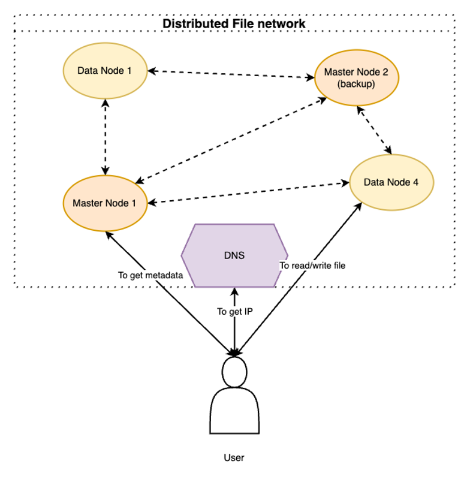

<p style="text-align: center;font-size: 40px;font-weight: 900">Distributed File System</p>


</img>

# 1. Features

System supports file storing and auto-backup among different nodes. The coordination and communication protocol are tailored.

- Heartbeat
- File read/write
- State syncrhonization
- Auto-replication when a node is down

# 2. Preliminaries

### 2.1. Compiling static library for `sqlite3` for `arm64-v8a`

Running this project in MacOS or Linux doesn't require this step. Instead, we can correspondingly use the following command to install `libsqlite` for Ubuntu or MacOS:

```bash
sudo apt install sqlite3
```

or

```bash
brew install sqlite
```

The following steps are necessary as running in Android.

1. Download NDK from Google
2. Download `sqlite` from official GitHub: [link](https://github.com/sqlite/sqlite)
3. Run the following

```bash
mkdir sqlite_arm64-v8a
cd sqlite_arm64-v8a
../sqlite/configure \
  --host=aarch64-linux-android \
  CC=/path/to/clang/of/ndk \
  --enable-shared
make
```

where

- `/path/to/clang/of/ndk` indicates the path to `clang` of NDK
  Example: `~/Library/Android/sdk/ndk/29.0.14033849/toolchains/llvm/prebuilt/darwin-x86_64/bin/aarch64-linux-android35-clang`

4. In file `./.cargo/config.toml`, section `aarch64-linux-android`, add

```
"-L", "/path/to/sqlite_arm64-v8a"
```

# 3. Start

Start DNS

```bash
./dfs dns <port>
```

Start Master

```bash
./dfs master <port>
```

Start data

```bash
./dfs data <port>
```

# Coordination

As adding a node to system, during start-up phase, at least one 1 ip of currently active Node
